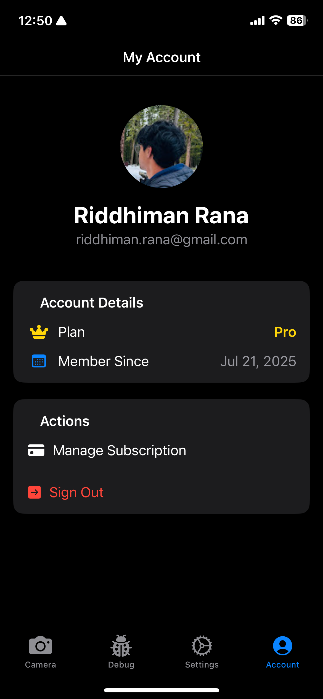
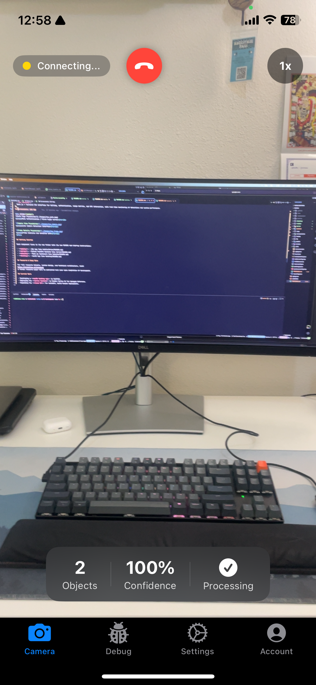
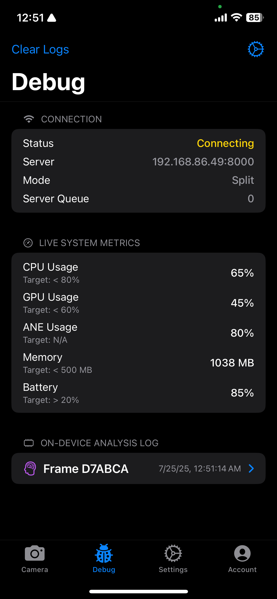
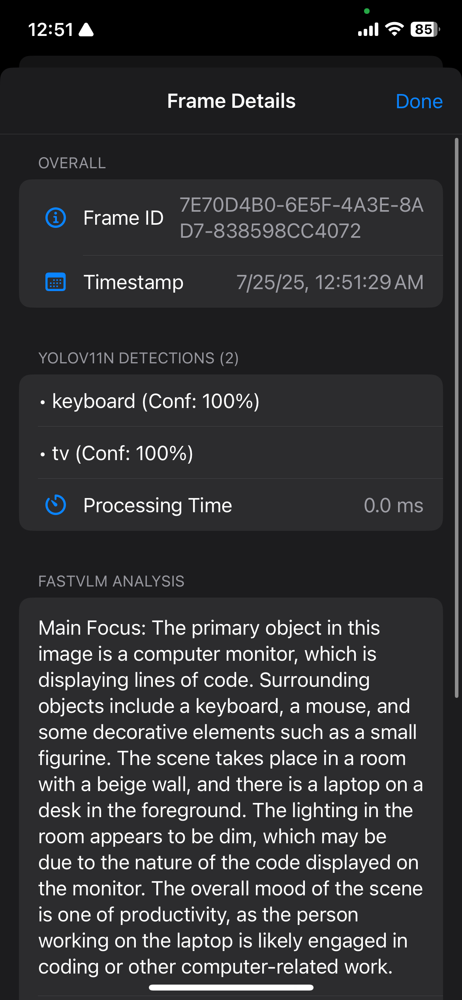
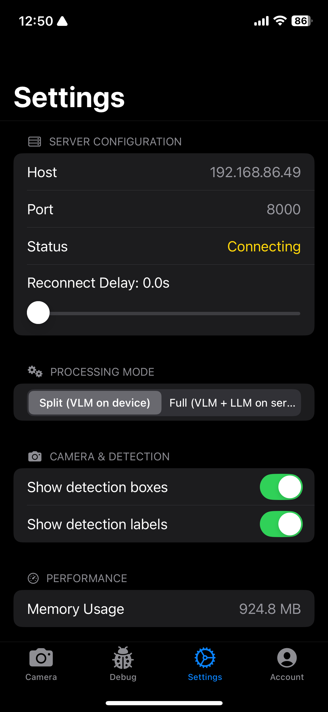
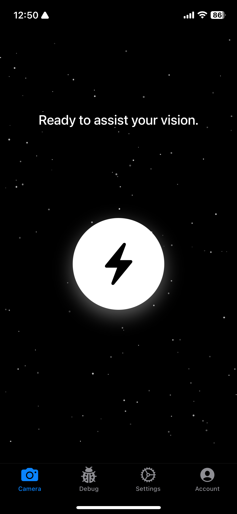

# Orion Live iOS App

Orion Live is the iOS app designed to work seamlessly with the Orion architecture and backend services.

## Requirements

- Xcode 16 or later
- iOS 18.0 or later
- Swift 5.8 or later

## Frameworks

- SwiftUI for building the user interface
- CoreML for on-device machine learning
- Combine for reactive data binding
- URLSession for networking

## Screenshots

| AccountView | CameraView | DebugView | FrameDetailsView | SettingsView | StartView |
|:-----------:|:----------:|:---------:|:---------------:|:------------:|:---------:|
|  |  |  |  |  |  |

**AccountView**
Manages user authentication, profile, and account-related settings.

**CameraView**
Main interface for live camera feed, running on-device YOLO and VLM models, and streaming detections to the server.

**DebugView**
Displays logs, diagnostics, and internal state for development and troubleshooting.

**FrameDetailsView**
Shows detailed information for a selected detection frame, including bounding boxes and VLM descriptions.

**SettingsView**
Allows configuration of app preferences, server URLs, and model options.

**StartView**
Initial landing screen for onboarding and navigation to other app sections.

## Deployment Target

- iPhone 12 and newer devices running iOS 18+

## Getting Started

1. Clone the repository:

   ```bash
   git clone https://github.com/riddhimanrana/orion
   cd orion/mobile
   ```

2. Download the YOLO11N and custom fine-tuned FastVLM coreml models:

   ```bash
   sh setup_models.sh
   ```

3. Open the project in Xcode:

   ```bash
   open Orion\ Live.xcodeproj
   ```

## Configuration

The file `Info.plist` contains auth endpoints and keys.

Feel free to replace them with your own database or authentication endpoints.

In addition, the folder `Configuration/Build.xconfig` contains a `DISAMBIGUATOR` configuration to make it easier to build and run a sample code project. Once you set your project's development team, you'll have a unique bundle identifier.

## Running the App

- Select a simulator or device in Xcode
- Press `⌘`+`R` or click **Run**
