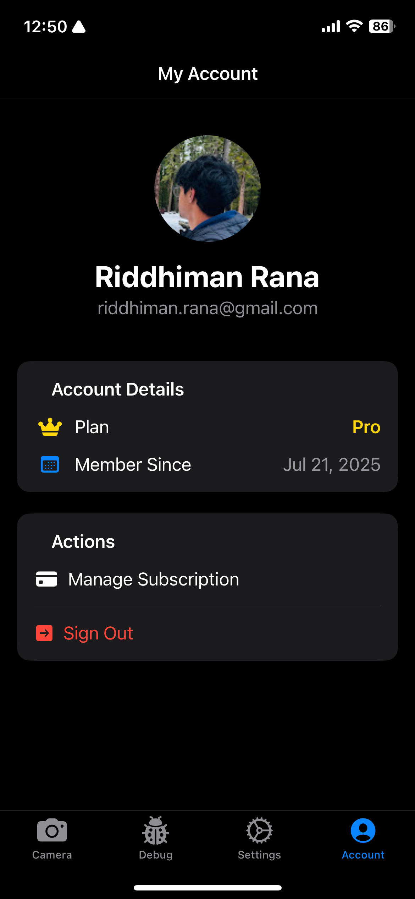
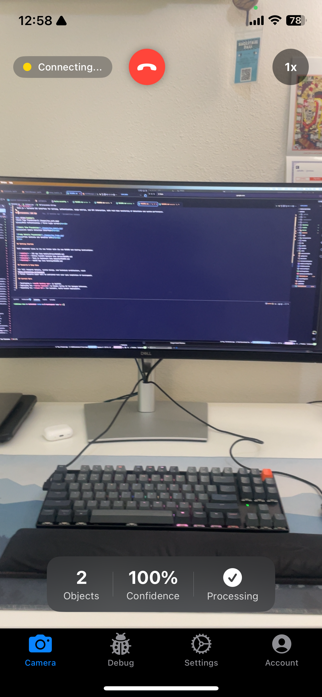
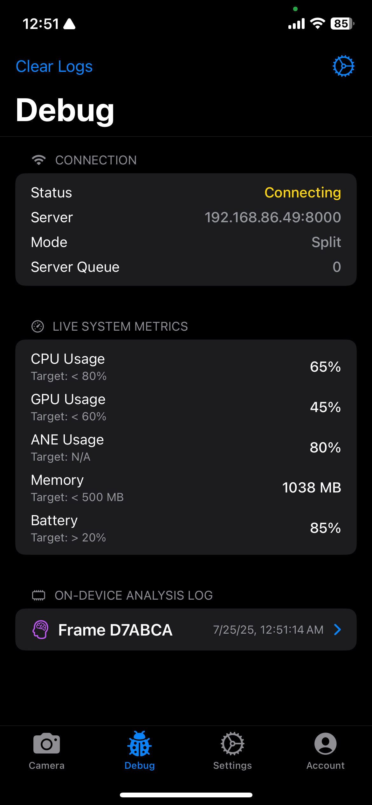
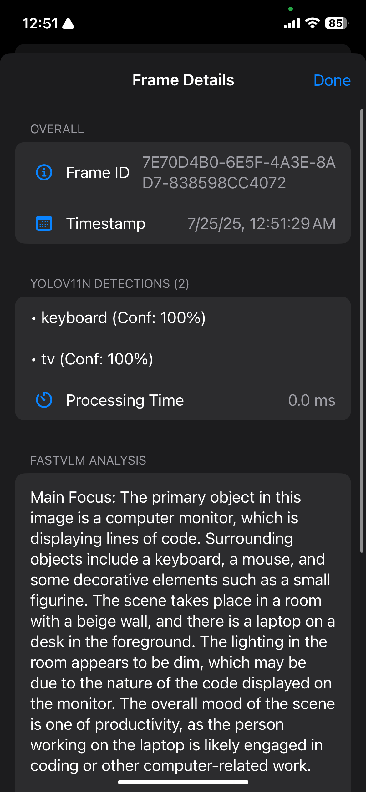
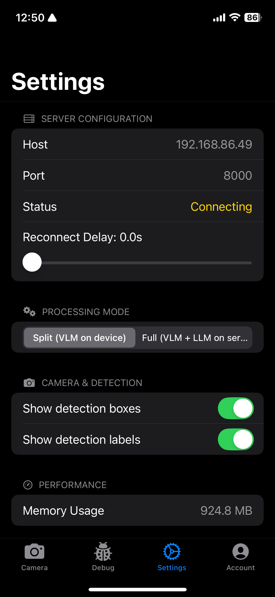
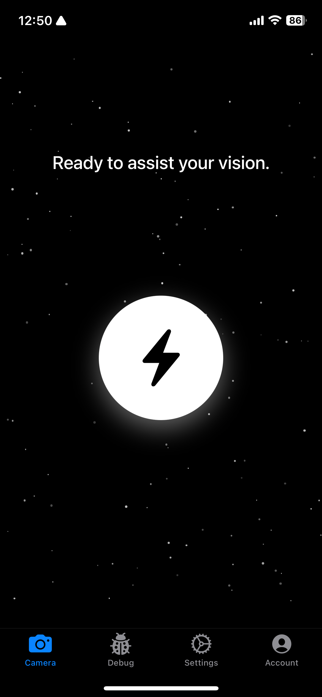

# Orion Live iOS App

Orion Live is the iOS app designed to work seamlessly with the Orion architecture and backend services.

## Requirements

- Xcode 16 or later
- iOS 18.0 or later
- Swift 5.8 or later

## Frameworks

- SwiftUI for building the user interface
- CoreML for on-device machine learning
- Combine for reactive data binding
- URLSession for networking

## Screenshots

| AccountView | CameraView | DebugView | FrameDetailsView | SettingsView | StartView |
|:-----------:|:----------:|:---------:|:---------------:|:------------:|:---------:|
|  |  |  |  |  |  |

**AccountView**  
Manages user authentication, profile, and account-related settings.

**CameraView**  
Main interface for live camera feed, running on-device YOLO and VLM models, and streaming detections to the server.

**DebugView**  
Displays logs, diagnostics, and internal state for development and troubleshooting.

**FrameDetailsView**  
Shows detailed information for a selected detection frame, including bounding boxes and VLM descriptions.

**SettingsView**  
Allows configuration of app preferences, server URLs, and model options.

**StartView**  
Initial landing screen for onboarding and navigation to other app sections.

## Deployment Target

- iPhone 12 and newer devices running iOS 18+

## Getting Started

1. Clone the repository:

   ```bash
   git clone https://github.com/riddhimanrana/orion
   cd orion/mobile
   ```

2. Download the YOLO11N and custom fine-tuned FastVLM coreml models:

   ```bash
   sh setup_models.sh
   ```

3. Open the project in Xcode:

   ```bash
   open Orion\ Live.xcodeproj
   ```

## Configuration

The file `Info.plist` contains auth endpoints and keys.

Feel free to replace them with your own database or authentication endpoints.

In addition, the folder `Configuration/Build.xconfig` contains a `DISAMBIGUATOR` configuration to make it easier to build and run a sample code project. Once you set your project's development team, you'll have a unique bundle identifier.

## Running the App

- Select a simulator or device in Xcode
- Press `⌘`+`R` or click **Run**

# Orion Live: P2P Connection System

This document outlines the Orion Live ecosystem, a peer-to-peer (P2P) connection system for iOS and macOS apps using WebRTC, with signaling, TURN, and Supabase integration.

## Overview

Orion Live enables secure, real-time communication between an iOS device (Orion Live app) and a macOS device (Orion Server app) for features like LLM streaming over P2P data channels. The system uses WebRTC for direct or relayed connections, with fallback to cloud proxies.

Key components:

- **iOS App (Orion Live)**: Initiates connections, handles UI, streams LLM requests.
- **macOS App (Orion Server)**: Responds to connections, runs local LLMs, streams responses.
- **Signaling Server (signal.orionlive.ai)**: WebSocket relay for SDP/ICE negotiation; HTTP endpoints for auth and ICE creds.
- **TURN Server (turn.orionlive.ai)**: Relays traffic when direct P2P fails.
- **Supabase**: Auth, device pairing, usage logging.

## Architecture

### Connection Flow

1. **Pairing & Auth**: Users sign in via Supabase on both devices. Devices register and pair into a `pairId`.
2. **WebRTC JWT**: Each app fetches a JWT token for signaling (includes `userId`, `deviceId`, `pairId`).
3. **Signaling**: WebSocket connection to signaling server for offer/answer/ICE exchange.
4. **Ephemeral ICE**: Fetch short-lived TURN credentials from signaling server.
5. **ICE Negotiation**: STUN for direct paths; TURN for relay. Data channel opens for JSON messages (ping/pong, future LLM).
6. **Data Streaming**: Reliable ordered data channel for P2P messages.

### Servers & Endpoints

#### Signaling Server (signal.orionlive.ai)

- **WebSocket**: `wss://signal.orionlive.ai?token=<WEBRTC_JWT>`
  - Relays messages: `{"t":"offer","sdp":"..."}`, `{"t":"answer","sdp":"..."}`, `{"t":"ice","candidate":"..."}`, `{"t":"bye"}`.
  - Validates JWT and pairId ownership.

- **HTTP GET /v1/ice** (Ephemeral TURN Credentials)
  - Auth: Bearer `<WEBRTC_JWT>`
  - Response: `{"urls":["turn:turn.orionlive.ai:3478?transport=udp", ...], "username":"...", "credential":"...", "ttl":600, "expiresAt":..., "usage":{"countInWindow":1, "maxInWindow":20, "windowRemainingSec":599}}`
  - Rate-limited per user; logs to Supabase.

- **HTTP POST /auth/webrtc-token** (Mint WebRTC JWT)
  - Auth: Bearer `<SUPABASE_ACCESS_TOKEN>`
  - Body: `{"deviceId":"<DEVICE_ID>"}`
  - Response: `{"token":"<WEBRTC_JWT>"}`
  - Used by both apps to get signaling access.

- **HTTP GET /health** (Health Check)
  - Response: `{"status":"ok"}`

#### TURN Server (turn.orionlive.ai)

- CoTURN instance with HMAC auth.
- Ports: 3478/udp, 3478/tcp, 5349/tcp (TLS).
- Credentials minted by signaling server.

#### Supabase (<https://svltefplctinykebecyv.supabase.co>)

- **Auth**: Sign-in, session management.
- **Tables**:
  - `device_pairs`: Pairing data (`id`, `user_id`, `status`).
  - `ice_usage`: Logs (`user_id`, `pair_id`, `device_id`, `issued_at`, `ttl`).
- **Publishable Key**: Supabase client key in app Info.plist.

## Setup & Configuration

### Environment Variables (Signaling Server)

- `P2P_SIGNAL_JWT_SECRET`: Secret for JWT signing.
- `NEXT_PUBLIC_SUPABASE_URL`: Supabase URL.
- `SUPABASE_SECRET_KEY`: Secret key for trusted server DB access.
- `TURN_REALM`: `orionlive.ai`
- `TURN_REST_SECRET`: HMAC secret (matches CoTURN `static-auth-secret`).
- `TURN_URLS`: Comma-separated TURN URLs.
- `TURN_TTL`: 600 (seconds).
- `ICE_RATE_WINDOW_SEC`: 600
- `ICE_RATE_MAX`: 20

### App Configuration

- **iOS/macOS Info.plist**:
  - `SUPABASE_URL`: `https://svltefplctinykebecyv.supabase.co`
  - `SUPABASE_PUBLISHABLE_KEY`: Supabase publishable key.
  - `TURN_URLS`: Array of TURN URLs (fallback).
  - `TURN_USERNAME/PASSWORD`: Static fallback creds.
  - `NSMicrophoneUsageDescription`: Privacy string for WebRTC.

- **Entitlements (macOS)**: App Sandbox, network client, audio/camera input.

### Building & Running

1. **Signaling Server**: Deploy to Vercel/Cloudflare with env vars. Run `node signal/index.ts`.
2. **TURN Server**: CoTURN on Ubuntu with `use-auth-secret`, realm, and ports open.
3. **Apps**:
   - iOS: Xcode build, link WebRTC SPM.
   - macOS: Xcode build, link WebRTC/Supabase SPM, set entitlements.
4. **Test**: Sign in, pair devices, connect via signaling, ping over data channel.

## Message Contract (Data Channel)

- JSON envelope: `{"v":1, "t":"ping|pong|request|chunk|done|error", "id":"...", "ts":..., "correlationId":"...", "data":{...}}`
- Ping: `{"t":"ping", "id":"...", "ts":..., "data":{"clientTs":...}}`
- Pong: `{"t":"pong", "id":"...", "correlationId":"ping_id", "data":{"clientTs":...}}`
- Future LLM: Request/chunk/done for streaming.

## Security & Best Practices

- JWTs expire; ephemeral TURN creds rotate.
- Rate limits on /v1/ice; usage logged.
- HTTPS/WSS only; CORS restricted.
- Rotate `TURN_REST_SECRET` by updating CoTURN and server env.

## Troubleshooting

- Unauthorized on /v1/ice: Use WebRTC JWT, not Supabase token.
- No P2P: Check TURN ports; force relay for testing.
- macOS crash: Ensure entitlements and privacy strings.

For more details, see Docs/P2P_TEST_PLAN.md and Docs/TURN_SETUP.md.
