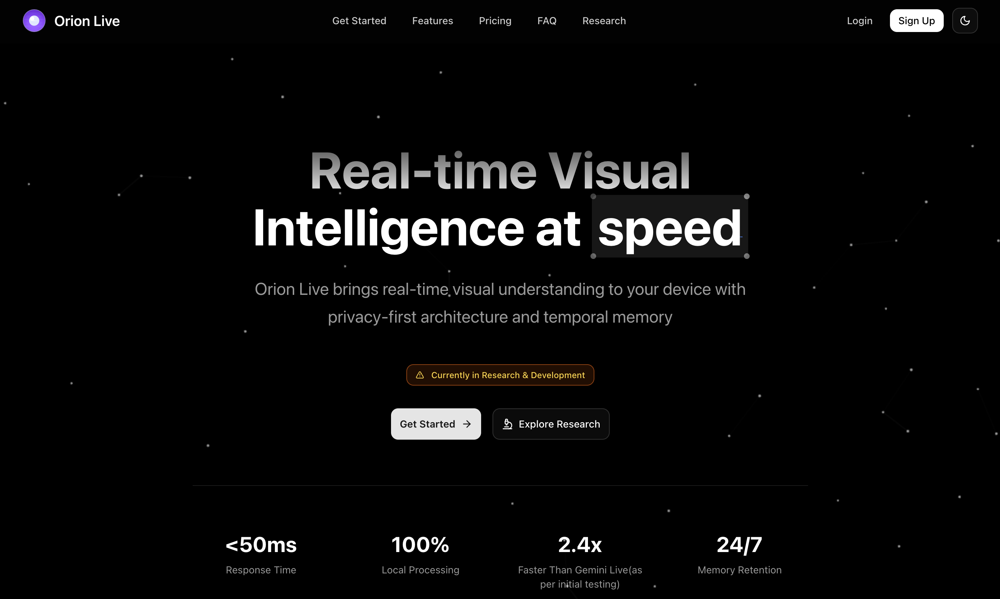
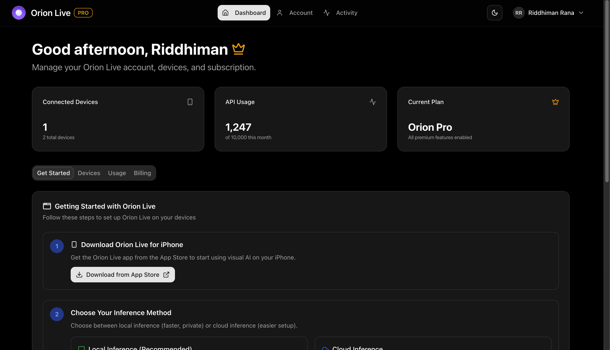

# Orion Website

This is the web front-end for the Orion architecture which handles authentication, showcase research findings, dashboard pages, and billing setups. It is very fast, entirely mobile-responsive, and has a modern design built with Next.js and Tailwind CSS.

## Features

- Research dashboard with technical deep dives and related works  
- Vector database query examples and validation metrics  
- User authentication (sign up, login, email change, confirmation)  
- Account management (profile, email updates)  
- Responsive UI built with Tailwind CSS and Lucide icons  

## Technologies

- [Next.js](https://nextjs.org/) — React framework for handling SSR, routing, and API routes  
- [shadcn/ui](https://ui.shadcn.com/) — Tailwind Component library for Orion's web interface
- [Aceternity UI](https://ui.aceternity.com/) — Used for certain components in the Orion UI (like the 'speed' text in the landing page)
- [Supabase](https://supabase.com/) — Backend database service for handling user auth, storage, and billing data
- [Vercel](https://vercel.com/) — Deployment/hosting platform for the website
- [Cloudflare](https://cloudflare.com/) — Domain CDN and DNS management

## Screenshots

| Landing Page | Main Dashboard |
|--------------|----------------|
|  |  |

## Getting Started

### Installation

1. Clone the repo  

   ```bash
   git clone https://github.com/riddhimanrana/orion
   cd orion/website
   ```

2. Install dependencies  

   ```bash
   bun install
   ```

3. Create a `.env.local` file based on `.env.example` and add your Supabase credentials.  

### Running Locally

```bash
bun run dev
```

Open [http://localhost:3000](http://localhost:3000) in your browser.

